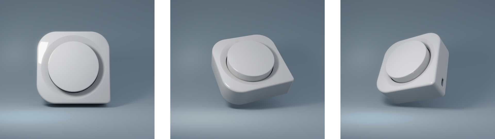

# Mediaknob

This is a DIY media control knob for your computer. Adjust your volume; skip songs; or press & hold the knob for attention mode. 

Print the parts, solder the components and upload to firmware. Go to [instruction.md](instructions.md) to see how to assemble and run the Mediaknob.

## Features

- **Turn Clockwise**: Turn volume up
- **Turn Counter-Clockwise**: Turn volume down
- **Single Click**: Pause/Play
- **Double Click**: Next song
- **Tripple Click**: Previous song
- **Long Click Hold**: Attention mode (Mutes volume while button is pressed) 

## Acknowledgements

The knob is our first try at building physical device. Although this is very different, the initial inspiration came from the [Smartknob](https://youtu.be/ip641WmY4pA?si=oMXHZ1xV06TqFzg1). This project served as a relativally simple test to get our feet wet in the world of 3D printing and electronics.