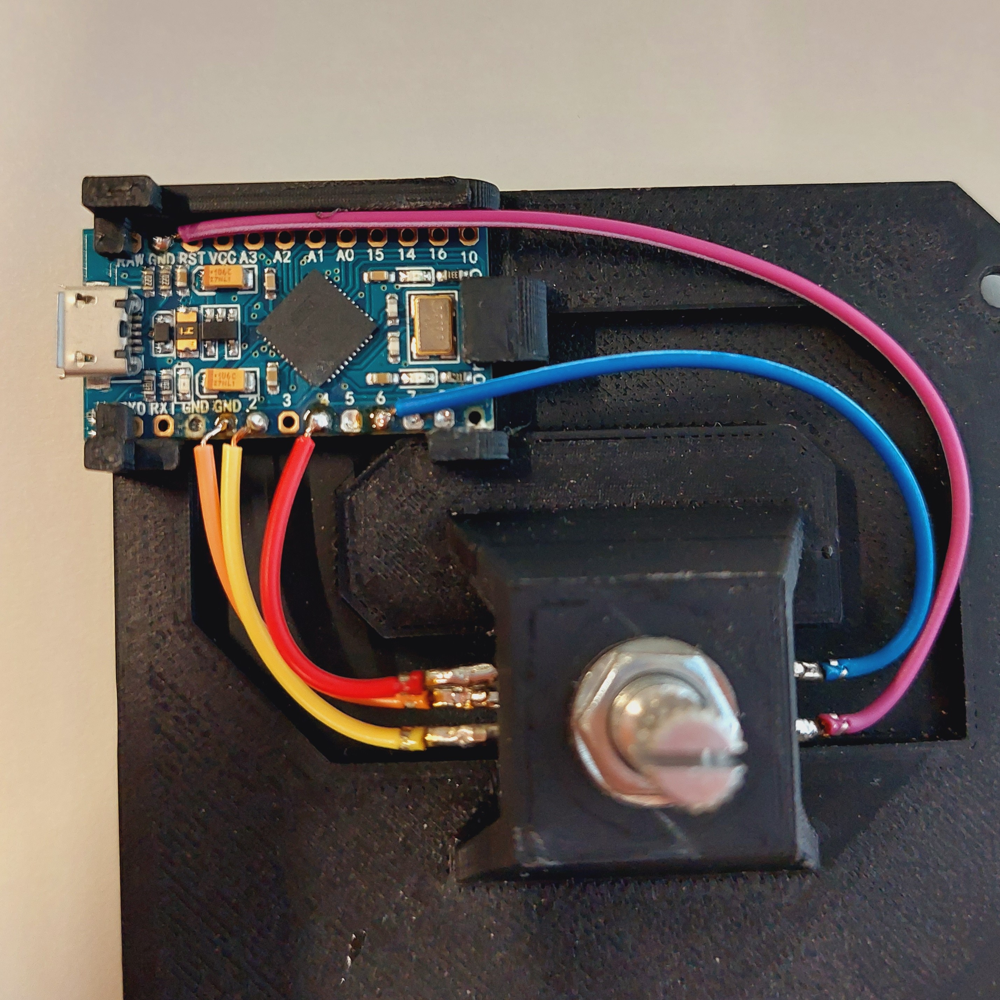

# Instructions

Here you will find the component list, schematics, and instructions to build the media knob.

## Components

- Arduino Pro Micro 5V ([Sparkfun](https://www.sparkfun.com/products/12640))
  - Make sure you buy a Pro Micro with identical dimensions to the Sparkfun one
- EC11 Rotary encoder ([Aliexpress](https://nl.aliexpress.com/item/1005002802225957.html?spm=a2g0o.productlist.main.73.1a476867OZREEx&algo_pvid=b6bf1163-fa66-4662-8d6a-866a64e69d97&algo_exp_id=b6bf1163-fa66-4662-8d6a-866a64e69d97-36&pdp_npi=4%40dis%21EUR%210.63%210.51%21%21%210.67%21%21%40211b617a16933239714535859e7a21%2112000022266485904%21sea%21NL%210%21A&curPageLogUid=IVOv2xvNuyEq))
- All 3D printed parts STL files can be found in [3d](/3d)
- Some electrical wire or five jumper wires
- Micro USB cable

## Electrical Schematic

The pins in this schematic are connected to `D8` through `D10`. However, in this build, you could use any digital pin, or analog pin for that matter, as we will not be doing anything more than digitalreads from the pins.

## Upload Firmware

First make sure that you have solderd your knob completely.

1. Clone this repository: `git clone https://github.com/WouterPennings/mediaknob.git`
2. Install [Arduino IDE 2.X](https://www.arduino.cc/en/software)
3. Install the `Button2` and `HID-Project` on the left side of the screen in the `Library` tab
4. Plug your Arduino Pro Micro in the Micro USB cable, select the correct COM port.
5. Press the `Upload` button and wait until the code is compiled and uploaded to your Arduino

> **Tip**: Use the serial monitor to debug if your knob show unexpected behaviour

## Assembly Steps

> TODO
